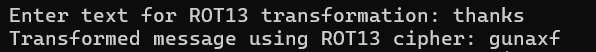

# Cyper Tool
## The Cyper Tool functions
The Cypher Tool is a command-line application crafted for encrypting and decrypting messages using different ciphers. It enables users to encode plain text for confidentiality or decode ciphered text to restore the original content.

## Usage of the tool with an example

Choose the operation you want to perform: enter **"1"** for encrypt or **"2"** for decrypt and press **enter**.

>
Next you need to choose cryptographic method. Select a cipher. **"1"** for **ROT13**, **"2"** for **Reverse** and **"3"** to **Simple Substitution** and push **enter**.

>
Now enter whatever you want to encrypt or decrypt and let the programm work its magic.

  

## Cyphers used
  
**ROT13** shifts each letter in the alphabet by 13 positions.   

>
    
**Reverse** cipher reverses the characters in a message with their opposit letters in the alphabet.

 

>   

**Simple Substitution** shifts each letter in the alphabet one step forward.

>

#### Done and done!
